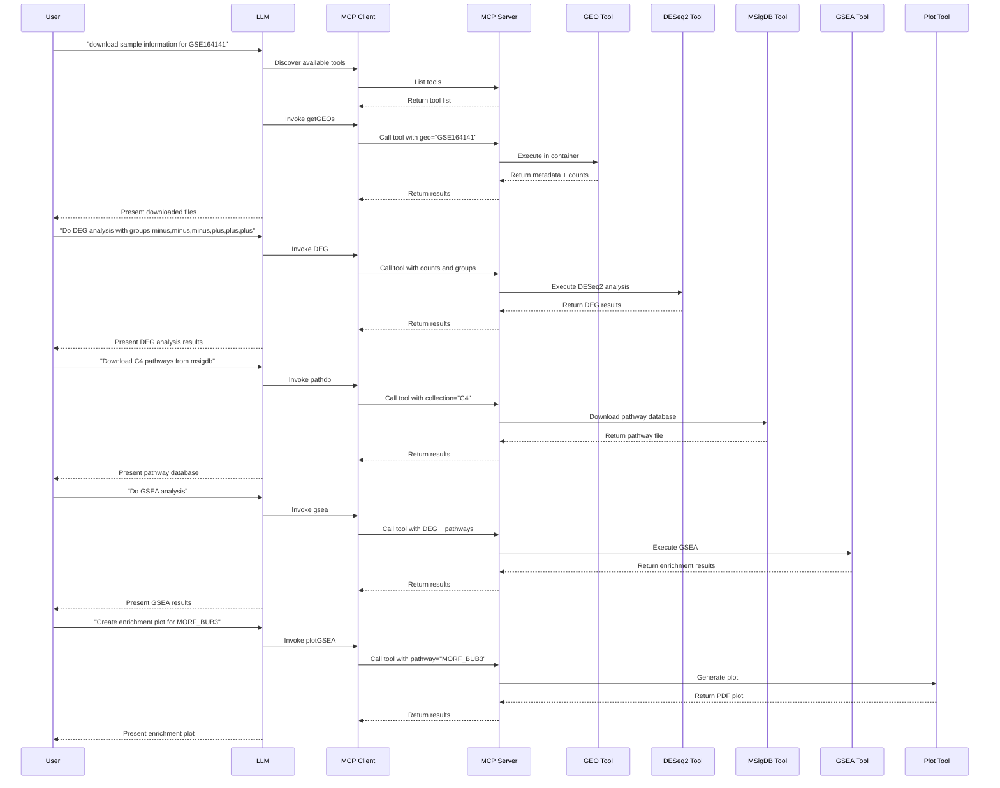

# Use Case: RNA-Seq Differential Expression and Pathway Analysis

## Overview

This use case demonstrates how to use Coala to perform a complete RNA-Seq analysis workflow: downloading data from GEO, performing differential gene expression (DEG) analysis, running Gene Set Enrichment Analysis (GSEA), and generating enrichment plots. We'll use the GSE164141 dataset as an example, which contains RNA-Seq data from BT549 breast cancer cells.

## Setup

### MCP Server Configuration

Create an MCP server with RNA-Seq analysis tools as shown in `examples/RNASeq/rnaseq_question.py`:

```python
from coala.mcp_api import mcp_api
import os
base_dir = os.path.dirname(__file__)

mcp = mcp_api(host='0.0.0.0', port=8000)
mcp.add_tool(os.path.join(base_dir, 'getGEOs.cwl'), 'getGEOs', read_outs=False)
mcp.add_tool(os.path.join(base_dir, 'DEG.cwl'), 'DEG', read_outs=False)
mcp.add_tool(os.path.join(base_dir, 'pathdb.cwl'), 'pathdb', read_outs=False)
mcp.add_tool(os.path.join(base_dir, 'gsea.cwl'), 'gsea', read_outs=False)
mcp.add_tool(os.path.join(base_dir, 'plotGSEA.cwl'), 'plotGSEA', read_outs=False)
mcp.serve()
```

This server exposes five tools:
- **`getGEOs`**: Downloads sample metadata and expression matrices from GEO database
- **`DEG`**: Performs differential expression analysis using DESeq2
- **`pathdb`**: Downloads pathway gene sets from MSigDB
- **`gsea`**: Runs Gene Set Enrichment Analysis
- **`plotGSEA`**: Creates enrichment plots for specific pathways

### MCP Client Configuration

Configure your MCP client (e.g., in Cursor) to connect to the server:

```json
{
    "mcpServers": {
        "coala": {
            "url": "http://localhost:8000/mcp",
            "transport": "streamable-http"
        }
    }
}
```

## Use Case Workflow

### Step 1: Download GEO Dataset

**User Query:**
```
download sample information and count matrix for GSE164141
```

**What Happens:**
1. The LLM identifies that GEO data download is needed
2. It discovers the `getGEOs` tool via the MCP client
3. The tool is invoked with parameter: `geo="GSE164141"`
4. The tool executes in a containerized environment using GEOquery
5. Two files are returned: series matrix (metadata) and count matrix

**Results:**
- **Series Matrix:** `GSE164141_series_matrix.txt.gz` (~2.5 KB) - Contains sample metadata
- **Count Matrix:** `GSE164141_BT549_RawCounts_Matrix.csv.gz` (~443 KB) - Contains raw counts for RNA-Seq samples

### Step 2: Differential Expression Analysis

**User Query:**
```
For the Count Matrix of GSE164141, sample can be labelled to 2 groups: minus,minus,minus,plus,plus,plus. Do a DEG for the samples between the two groups.
```

**What Happens:**
1. The LLM identifies that differential expression analysis is needed
2. It discovers the `DEG` tool via the MCP client
3. The tool is invoked with parameters:
   - `counts`: Path to the count matrix from Step 1
   - `group`: "minus,minus,minus,plus,plus,plus"
4. The tool executes DESeq2 analysis in a containerized environment
5. Results with log2 fold changes and p-values are returned

**Results:**
- **Output file:** `DEG_plus_minus.csv` (~4.5 MB)
- **Content:** Differential expression results with columns:
  - `baseMean`: Average normalized count
  - `log2FoldChange`: Log2 fold change (plus/minus)
  - `lfcSE`: Standard error
  - `stat`: Wald test statistic
  - `pvalue`: Raw p-value
  - `padj`: Adjusted p-value (BH correction)

### Step 3: Download Pathway Database

**User Query:**
```
Download C4 pathways from msigdb.
```

**What Happens:**
1. The LLM identifies that pathway data is needed
2. It discovers the `pathdb` tool via the MCP client
3. The tool is invoked with parameters:
   - `collection`: "C4"
   - `species`: "human"
4. The tool downloads the MSigDB C4 collection (computational gene sets)

**Results:**
- **Output file:** `human_C4_pathway.txt` (~615 KB)
- **Content:** C4 collection containing:
  - Cancer modules
  - Cancer gene neighborhoods
  - Computationally derived gene sets

### Step 4: Gene Set Enrichment Analysis

**User Query:**
```
Do a GSEA analysis using the previous DEG results and downloaded C4 pathways.
```

**What Happens:**
1. The LLM identifies that GSEA is needed
2. It discovers the `gsea` tool via the MCP client
3. The tool is invoked with parameters:
   - `deg_res`: Path to DEG results from Step 2
   - `pathways`: Path to pathway file from Step 3
4. The tool performs GSEA using ranked gene statistics
5. Enrichment results for all pathways are returned

**Results:**
- **Output file:** `gsea_ranked.csv` (~260 KB)
- **Content:** GSEA results including:
  - Pathway names
  - Enrichment scores (ES)
  - Normalized enrichment scores (NES)
  - P-values and adjusted p-values
  - Leading edge genes

### Step 5: Generate Enrichment Plot

**User Query:**
```
create enrichment plot for "MORF_BUB3" pathway
```

**What Happens:**
1. The LLM identifies that an enrichment plot is needed
2. It discovers the `plotGSEA` tool via the MCP client
3. The tool is invoked with parameters:
   - `deg_res`: Path to DEG results
   - `pathways`: Path to pathway file
   - `pathway_plot`: "MORF_BUB3"
4. The tool generates a visualization of the enrichment

**Results:**
- **Output file:** `MORF_BUB3.pdf` (~9 KB)
- **Content:** Enrichment plot showing:
  - Running enrichment score curve
  - Gene hit locations in ranked list
  - Ranking metric distribution

## Workflow Diagram



## Key Benefits

1. **Complete Workflow**: End-to-end RNA-Seq analysis from data download to visualization
2. **Natural Language Interface**: Complex bioinformatics analysis accessible through simple queries
3. **Automatic Tool Chaining**: Results from one step are automatically used in subsequent steps
4. **Reproducible Analysis**: All tools run in containerized environments with specified versions
5. **Flexible Grouping**: Sample groups can be specified dynamically for any experimental design
6. **Multiple Pathway Collections**: Access to all MSigDB collections (H, C1-C8) for comprehensive analysis
7. **Human-in-the-Loop Analysis**: Users maintain full control throughout the analysis process. You can adjust p-value cutoffs for significance thresholds, specify pathways of interest for focused analysis, modify sample groupings, select different pathway collections based on biological context, and generate custom visualizations for specific pathways—all through natural language interaction without modifying code

## Technical Details

### Tool Execution

All tools execute in Docker containers as specified in their CWL definitions:
- **GEOquery**: Bioconductor package for GEO data retrieval (v2.74.0)
- **DESeq2**: Bioconductor package for differential expression (v1.46.0)
- **fgsea**: Fast GSEA implementation for pathway analysis

### Data Flow

1. GEO dataset is downloaded with metadata and count matrix
2. Count matrix is normalized and analyzed by DESeq2
3. Genes are ranked by test statistic for GSEA
4. Pathway enrichment is computed and visualized

### Output Files

| Step | File | Description |
|------|------|-------------|
| 1 | `*_series_matrix.txt.gz` | Sample metadata |
| 1 | `*_RawCounts_Matrix.csv.gz` | Raw count matrix |
| 2 | `DEG_*.csv` | Differential expression results |
| 3 | `*_pathway.txt` | Pathway gene sets |
| 4 | `gsea_ranked.csv` | GSEA enrichment results |
| 5 | `*.pdf` | Enrichment plot |

## Extending the Workflow

This use case can be extended to:
- Analyze multiple GEO datasets for meta-analysis
- Use different pathway collections (Hallmark, KEGG, Reactome, GO)
- Apply different DEG methods (edgeR, limma-voom)
- Generate heatmaps of top differentially expressed genes
- Perform over-representation analysis (ORA) in addition to GSEA
- Export results in formats compatible with other visualization tools

All of these extensions can be implemented by adding additional CWL tools to the MCP server and querying them through natural language.
