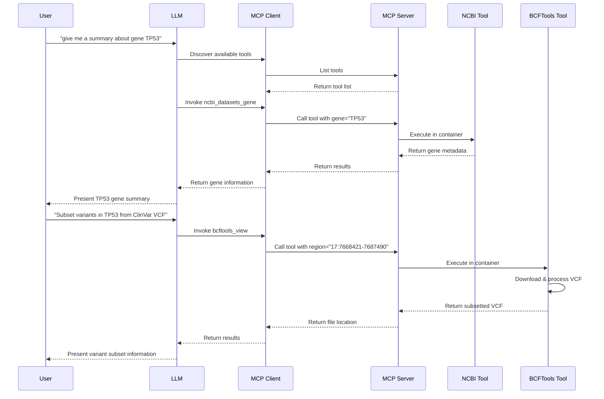

# Use Case: TP53 Gene Analysis with ClinVar Variants

## Overview

This use case demonstrates how to use Coala to perform a complete gene analysis workflow: first retrieving gene metadata from NCBI, then subsetting relevant variants from a large VCF file. We'll use the TP53 gene as an example, which is a critical tumor suppressor gene associated with many human cancers.

## Setup

### MCP Server Configuration

Create an MCP server with bioinformatics tools as shown in `examples/bioinfo_question.py`:

```python
from coala.mcp_api import mcp_api

mcp = mcp_api(host='0.0.0.0', port=8000)
mcp.add_tool('examples/ncbi_datasets_gene.cwl', 'ncbi_datasets_gene')
mcp.add_tool('examples/bcftools_view.cwl', 'bcftools_view', read_outs=False)
mcp.serve()
```

This server exposes two tools:
- **`ncbi_datasets_gene`**: Retrieves comprehensive gene metadata from NCBI datasets
- **`bcftools_view`**: Subsets and filters VCF/BCF files by genomic regions

### MCP Client Configuration

Configure your MCP client (e.g., in Cursor) to connect to the server:

```json
{
    "mcpServers": {
        "coala": {
            "url": "http://localhost:8000/mcp",
            "transport": "streamable-http"
        }
    }
}
```

## Use Case Workflow

### Step 1: Retrieve Gene Information

**User Query:**
```
give me a summary about gene "TP53"
```

**Tool Invocation:**
```json
{
  "tool": "ncbi_datasets_gene",
  "parameters": {
    "gene": "TP53",
    "taxon": "human"
  }
}
```

**Tool Response:**
```json
{
  "gene_info": {
    "gene_id": "7157",
    "symbol": "TP53",
    "description": "tumor protein p53",
    "chromosome": "17",
    "genomic_range": {
      "begin": 7668421,
      "end": 7687490
    }
  },
  "tool_name": "ncbi_datasets_gene",
  "tool_version": "ncbi/datasets-cli:latest"
}
```

**Chat Response:**
> Here's a summary of the **TP53** gene:
>
> **Basic Information:**
> - **Gene Name:** TP53 (tumor protein p53)
> - **Gene ID:** 7157
> - **Chromosome:** 17
> - **Location (GRCh38.p14):** Chromosome 17: 7,668,421-7,687,490
>
> **Function:**
> TP53 is a tumor suppressor protein with transcriptional activation, DNA binding, and oligomerization domains. It plays critical roles in:
> - DNA damage response
> - Cell cycle regulation
> - Apoptosis
> - Cellular senescence
>
> **Clinical Significance:**
> Mutations in TP53 are associated with many human cancers, including Li-Fraumeni syndrome.
>
> **Transcripts:** 26 total (25 protein-coding, 1 non-coding)

### Step 2: Subset Variants from ClinVar VCF

**User Query:**
```
Subset variants in the gene "TP53" from the https://ftp.ncbi.nlm.nih.gov/pub/clinvar/vcf_GRCh38/clinvar.vcf.gz
```

**Tool Invocation:**
```json
{
  "tool": "bcftools_view",
  "parameters": {
    "vcf": "https://ftp.ncbi.nlm.nih.gov/pub/clinvar/vcf_GRCh38/clinvar.vcf.gz",
    "region": "17:7668421-7687490",
    "fout": "tp53_variants.vcf.gz",
    "otype": "z"
  }
}
```

**Tool Response:**
```json
{
  "vcf_out": {
    "basename": "tp53_variants.vcf.gz",
    "size": 281600
  },
  "tool_name": "bcftools_view",
  "tool_version": "quay.io/biocontainers/bcftools:1.13--h3a49de5_0"
}
```

**Chat Response:**
> Successfully extracted TP53 variants from the ClinVar VCF file.
>
> **Output Details:**
> - **File:** `tp53_variants.vcf.gz`
> - **Size:** ~275 KB (compressed)
> - **Format:** Compressed VCF (gzipped)
>
> **Extraction Parameters:**
> - **Source:** ClinVar VCF (GRCh38)
> - **Region:** Chromosome 17: 7,668,421-7,687,490 (TP53 gene coordinates)
>
> **Content:**
> The output file contains all ClinVar variants overlapping the TP53 gene region. These variants include pathogenic, likely pathogenic, benign, likely benign, and variants of uncertain significance associated with TP53.
>
> You can further filter these variants by clinical significance or perform additional analysis on the extracted subset.

## Workflow Diagram



## Key Benefits

1. **Natural Language Interface**: Complex bioinformatics workflows are accessible through simple queries
2. **Automatic Tool Discovery**: The LLM automatically selects the appropriate tools based on the task
3. **Parameter Extraction**: Genomic coordinates are automatically extracted from gene metadata for downstream analysis
4. **Containerized Execution**: Tools run in isolated containers, ensuring reproducibility and avoiding dependency conflicts
5. **Seamless Integration**: Multiple tools work together in a single workflow without manual intervention
6. **Remote Data Access**: Direct access to remote VCF files without manual download
7. **Human-in-the-Loop Analysis**: Users maintain full control throughout the analysis process. You can specify different genes, adjust genomic regions, filter variants by clinical significance, change output formats, and query different VCF sources—all through natural language interaction without modifying code

## Technical Details

### Tool Execution

Both tools execute in Docker containers as specified in their CWL definitions:
- **NCBI Datasets**: Queries NCBI's gene database API
- **BCFTools**: Uses bcftools 1.13 for VCF processing

### Data Flow

1. Gene metadata is retrieved as JSON from NCBI
2. Genomic coordinates are parsed from the metadata
3. These coordinates are used to subset the VCF file
4. The subsetted VCF is saved as a compressed file

### Output Files

The subsetted VCF file contains:
- All variants from ClinVar that overlap the TP53 gene region
- Standard VCF format with headers and variant records
- Compressed format for efficient storage

## Extending the Workflow

This use case can be extended to:
- Filter variants by clinical significance
- Annotate variants with additional databases
- Perform statistical analysis on variant frequencies
- Generate visualizations of variant distribution
- Compare variants across different populations

All of these extensions can be implemented by adding additional CWL tools to the MCP server and querying them through natural language.

